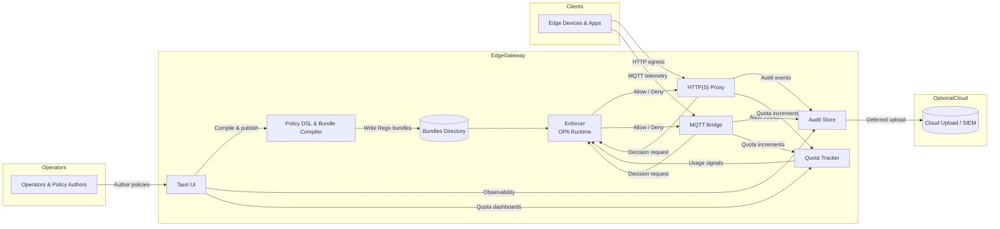

# Edge Policy Hub

> Tauri-powered, multi-tenant ABAC gateway with OPA/Rego enforcement

A click-to-deploy edge gateway that enforces data residency, privacy, and cost guardrails at the edge with minimal operational overhead. Built for small/medium sites and remote offices that need policy-as-code with multi-tenant isolation.

## Overview

Edge Policy Hub consolidates scattered policy enforcement (firewalls, proxies, scripts, app code) into a unified, human-readable policy-as-code framework. It runs on local gateways with a Tauri desktop UI for operators, compiling fine-grained ABAC policies into OPA/Rego bundles for local enforcement.

### Key Features

- **Multi-tenant Isolation**: Hard separation by `tenant_id` with namespace-scoped policies and data
- **ABAC Policy Model**: Device/user/resource/environment attributes with geo, time, network, and risk-score awareness
- **OPA/Rego Enforcement**: Deterministic local decisions with p99 < 2ms latency
- **Protocol Support**: HTTP(S) egress proxy and MQTT broker/bridge
- **Data Residency**: Block/allow based on geo/ASN/subnet with PII redaction at edge
- **Cost Guardrails**: Bandwidth/egress quotas per tenant (e.g., stop uploads >100 GB/month)
- **Click-to-Deploy**: Tauri installer for Windows/Linux/macOS with auto-start and self-update
- **Offline-First**: Full functionality without cloud connectivity
- **Audit Logging**: Signed, append-only local store with deferred upload

## Use Cases

```
Example: GDPR Data Residency
"TenantA.devices may read sensorX only if attr.region == 'EU' and env == 'prod'"

Example: Cost Control
Block uploads when monthly bandwidth > 100 GB per tenant

Example: Zero-Trust Enclaves
Enforce per-tenant isolation using tenant_id attributes even when roles match
```

## Architecture

### Mono-repo Layout

```
edge-policy-hub/
  ├── apps/tauri-ui/              # Desktop UI for operators
  ├── services/enforcer/          # OPA sidecar + policy API
  ├── services/proxy-http/        # HTTP(S) egress proxy
  ├── services/bridge-mqtt/       # MQTT broker/bridge
  ├── libs/policy-dsl/            # ABAC -> Rego compiler
  ├── libs/rego-bundles/          # Shared rules & tests
  ├── infra/                      # Dockerfiles, Helm, systemd
  └── examples/                   # Sample tenants & policies
```

### Components

- **Tauri UI**: Cross-platform desktop app for policy management and monitoring
- **Enforcer Service**: OPA integration with per-tenant policy bundles
- **HTTP Proxy**: HTTPS egress proxy with policy enforcement
- **MQTT Bridge**: Broker/bridge for IoT telemetry with inline policy checks
- **Policy DSL**: Human-readable policy language compiled to Rego
- **Audit Store & Quota Tracker**: Persistent append-only audit trail and per-tenant usage accounting

### High-Level Flow



The diagram highlights how operators use the Tauri UI to author policies, compile them into Rego bundles, and distribute them to the Enforcer. Enforcement points (HTTP proxy and MQTT bridge) call the Enforcer for allow/deny decisions, stream signed audit events to the Audit Store, and update the Quota Tracker for per-tenant usage. The Audit Store can optionally synchronize logs to external destinations when connectivity is available, while the UI provides observability into both audit history and quota posture.

## Requirements

### Must Have (MVP)

- ✅ Multi-tenant isolation with hard separation
- ✅ ABAC policy model with rich attributes
- ✅ OPA/Rego enforcement (p99 < 2ms)
- ✅ HTTP(S) and MQTT protocol support
- ✅ Data residency guardrails
- ✅ Cost guardrails and quotas
- ✅ Click-to-deploy installer
- ✅ Audit logging (local, signed)
- ✅ Offline-first operation
- ✅ Admin UX with policy builder

### Planned Features

- Policy versioning & staged rollout (canary, per-tenant waves)
- Secrets & key management (TPM/secure enclave support)
- Schema-aware redaction (JSONPath/Protobuf)
- Health & metrics (Prometheus, tenant-scoped dashboards)
- Zero-trust posture (mTLS, SPIFFE IDs)

### Future Considerations

- gRPC and AMQP support
- Inline ML risk scoring
- Auto-policy recommendations
- Multi-node cluster mode for HA

## Getting Started

### Prerequisites

- Linux/Windows/macOS gateway (4-16 GB RAM recommended)
- Docker (for containerized deployment) or systemd (for native)
- Optional: TPM/secure enclave for enhanced secrets management

### Installation

- **Linux (Debian/Ubuntu)**
  ```bash
  wget https://github.com/acailic/edge-policy-hub/releases/latest/download/edge-policy-hub_1.0.0_amd64.deb
  sudo dpkg -i edge-policy-hub_1.0.0_amd64.deb
  sudo systemctl enable --now edge-policy-hub.target
  ```
- **Linux (RHEL/Fedora)**
  ```bash
  wget https://github.com/acailic/edge-policy-hub/releases/latest/download/edge-policy-hub-1.0.0-1.x86_64.rpm
  sudo rpm -i edge-policy-hub-1.0.0-1.x86_64.rpm
  sudo systemctl enable --now edge-policy-hub.target
  ```
- **Windows**
  1. Download `Edge_Policy_Hub_1.0.0_x64_en-US.msi`.
  2. Run the installer as Administrator and follow the wizard.
  3. The `EdgePolicyHub` Windows Service starts automatically.
- **macOS**
  1. Download `Edge_Policy_Hub_1.0.0_x64.dmg`.
  2. Drag **Edge Policy Hub** into Applications and launch the app.
- **Docker**
  ```bash
  cd infra/docker
  cp .env.example .env
  docker-compose up -d
  ```

> Detailed instructions for every platform are available in [docs/installation.md](docs/installation.md).

### Quick Start

1. **Launch Tauri UI**
   ```bash
   edge-policy-ui
   ```

2. **Create a tenant**
   - Navigate to Tenants → Add New
   - Configure tenant namespace and attributes

3. **Define policies**
   ```
   # Example: EU data residency
   allow read sensor_data if
     subject.tenant_id == "tenant-eu"
     resource.region == "EU"
     subject.device_location in ["DE", "FR", "NL"]
   ```

4. **Deploy policy bundle**
   - Compile to Rego
   - Push to local enforcer
   - Monitor enforcement in real-time

## Container Registry

Pre-built images are published to GitHub Container Registry:

- `ghcr.io/acailic/edge-policy-enforcer`
- `ghcr.io/acailic/edge-policy-proxy-http`
- `ghcr.io/acailic/edge-policy-bridge-mqtt`
- `ghcr.io/acailic/edge-policy-audit-store`
- `ghcr.io/acailic/edge-policy-quota-tracker`

Pull the latest release with:

```bash
docker pull ghcr.io/acailic/edge-policy-enforcer:latest
docker pull ghcr.io/acailic/edge-policy-proxy-http:latest
docker pull ghcr.io/acailic/edge-policy-bridge-mqtt:latest
docker pull ghcr.io/acailic/edge-policy-audit-store:latest
docker pull ghcr.io/acailic/edge-policy-quota-tracker:latest
```

Quick start with Docker Compose:

```bash
cd infra/docker
cp .env.example .env
docker-compose up -d
```

## Deployment

- **Linux (systemd)**: `sudo systemctl start edge-policy-hub.target` and manage individual services with `systemctl status edge-policy-enforcer`.
- **Windows Service**: `Get-Service EdgePolicyHub`, `Start-Service EdgePolicyHub`, `Stop-Service EdgePolicyHub`.
- **Docker Compose**: `docker-compose ps`, `docker-compose logs -f`.

Comprehensive production guidance is documented in [docs/deployment.md](docs/deployment.md).

## Configuration

### Bundles Directory

The policy bundles directory is where the Tauri backend writes compiled policy bundles and where the Enforcer watches for changes. Both services must be configured to use the same directory path.

**Default Location:**
- **All platforms**: `$CONFIG_DIR/edge-policy-hub/config/tenants.d`
  - Linux: `~/.config/edge-policy-hub/config/tenants.d`
  - macOS: `~/Library/Application Support/edge-policy-hub/config/tenants.d`
  - Windows: `C:\Users\{username}\AppData\Roaming\edge-policy-hub\config\tenants.d`

**Environment Variables:**
- **Tauri Backend**: Set `ENFORCER_BUNDLES_DIR` to override the default path
- **Enforcer Service**: Set `BUNDLES_DIR` to override the default path

**Important**: Both `ENFORCER_BUNDLES_DIR` and `BUNDLES_DIR` must point to the same absolute directory. If you override one, ensure you override the other to match.

**Example Configuration:**
```bash
# Set both to the same custom path
export ENFORCER_BUNDLES_DIR=/opt/edge-policy-hub/bundles
export BUNDLES_DIR=/opt/edge-policy-hub/bundles
```

The services will log the resolved bundles directory path on startup for verification.

### Policy Attributes (ABAC)

- **Subject**: `tenant_id`, `user_id`, `device_id`, `roles`, `clearance_level`
- **Action**: `read`, `write`, `delete`, `execute`, `subscribe`, `publish`
- **Resource**: `type`, `id`, `classification`, `region`, `owner_tenant`
- **Environment**: `time`, `geo`, `network`, `risk_score`, `session_trust`

### Multi-Tenant Isolation

Each tenant receives:
- Isolated policy namespace
- Dedicated OPA bundle
- Scoped data stores
- Separate audit logs
- Independent quotas

## Performance

- **Decision Latency**: p99 < 2ms (in-memory evaluation; verified via `benches/policy_latency.rs`)
- **Throughput**: Scales with gateway resources and workload modelling
- **Offline Operation**: Full functionality without cloud
- **Bundle Size**: Optimized per-tenant compilation
- **End-to-End Latency**: < 15ms p99 HTTP/MQTT path (see `benches/end_to_end_latency.rs`)

## Self-Update

The desktop UI checks GitHub Releases on startup and every few hours. When a newer version is available, operators receive an in-app banner to download and install the update. Updates are cryptographically signed and verified before installation. A manual check is available under **Settings → Check for Updates**. Releases are published at [acailic/edge-policy-hub/releases](https://github.com/acailic/edge-policy-hub/releases).

## Security

- Multi-tenant hard boundaries
- Zero-trust architecture ready (mTLS, SPIFFE)
- Signed audit logs (tamper-proof)
- Per-tenant secrets isolation
- Optional TPM/secure enclave integration

## Development

### Build from Source

```bash
git clone https://github.com/acailic/edge-policy-hub.git
cd edge-policy-hub

# Build Rust workspace (debug)
make build

# Build release binaries, installers, and Docker images
make build-all

# Install systemd units locally (requires sudo)
make install-systemd

# Launch Docker Compose deployment
make docker-up

# Run unit, integration, E2E, and OPA tests
make test-all

# Execute Criterion benchmarks
make bench

# Generate coverage report (requires cargo-tarpaulin)
make coverage
```

Useful targets are documented via `make help`.

### Project Structure

See [Architecture](#architecture) for detailed layout.

## Contributing

Contributions are welcome! Please read our [Contributing Guide](CONTRIBUTING.md) for details on our code of conduct and the process for submitting pull requests.

## Documentation

- [Getting Started Guide](docs/getting-started.md)
- [Testing Guide](docs/testing-guide.md)
- [API Reference](docs/api-reference.md)
- [Policy DSL Reference](docs/policy-dsl-reference.md)
- [Deployment Guide](docs/deployment.md)
- [Multi-Tenant Configuration](docs/multi-tenant.md)
- [Rego Bundle Development](docs/rego-bundles.md)
- [OpenAPI Specs](docs/openapi/)

## Examples

Sample tenants and policies demonstrating real-world guardrails live in [examples/](examples/):

- Tenant configurations: [EU Manufacturing](examples/tenants/tenant-eu-manufacturing.json), [US Retail](examples/tenants/tenant-us-retail.json), [APAC Logistics](examples/tenants/tenant-apac-logistics.json)
- Policy templates: [EU Manufacturing](examples/policies/eu-manufacturing-policy.dsl), [US Retail](examples/policies/us-retail-policy.dsl), [APAC Logistics](examples/policies/apac-logistics-policy.dsl), [Combined Production](examples/policies/combined-production-policy.dsl)
- Usage walkthrough: [examples/README.md](examples/README.md)

## Support

- **Issues**: [GitHub Issues](https://github.com/acailic/edge-policy-hub/issues)
- **Discussions**: [GitHub Discussions](https://github.com/acailic/edge-policy-hub/discussions)
- **Security**: Report vulnerabilities to security@edge-policy-hub.dev

## License

[MIT License](LICENSE)

## Roadmap

### v1.0 (MVP)
- Core ABAC enforcement
- HTTP/MQTT support
- Tauri UI v1
- Multi-tenant isolation

### v1.1
- Policy versioning
- Staged rollouts
- Enhanced metrics

### v2.0
- gRPC/AMQP support
- ML risk scoring
- Auto-policy recommendations
- Multi-node HA

## Why Edge Policy Hub?

**Edge-first architectures** create new compliance surfaces requiring data locality, lawful intercept, and offline operation. Traditional centralized policy systems don't work when devices roam or links are intermittent.

**ABAC fits edge metadata** (device traits, network, time window, risk score) better than static RBAC.

**Tauri enables** one-click, low-footprint cross-platform installers for non-DevOps operators.

**OPA/Rego is mature** for policy-as-code with bundle distribution and fast local evaluation.

---

*Built with ❤️ for edge-first compliance and governance*
